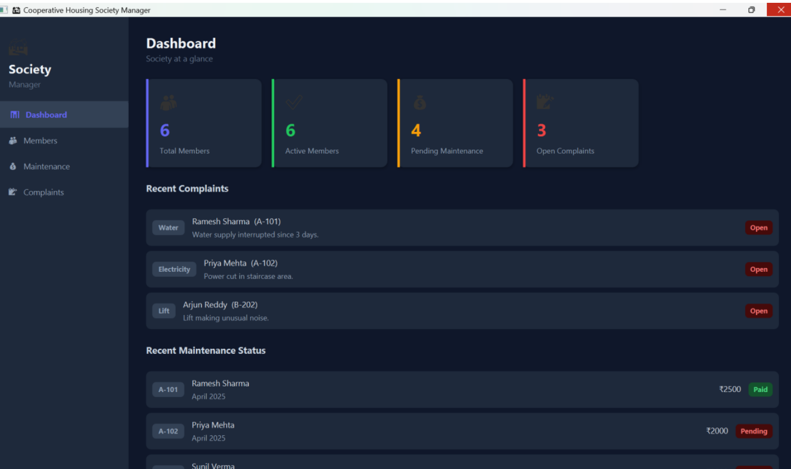

# 🏘️ Cooperative Housing Society Management System

A modern **JavaFX-based desktop application** designed to streamline residential society operations by providing a centralized platform for **member management, maintenance tracking, and complaint resolution**. The system offers a user-friendly interface, real-time dashboard insights, and efficient record management through a modular and scalable architecture.

---


---

# 📌 Project Overview

Managing a residential housing society involves maintaining member records, collecting maintenance fees, and resolving resident complaints efficiently.

This project provides a digital solution that automates these tasks through an interactive desktop application built using JavaFX. It enables society administrators to monitor key metrics, manage residents, track maintenance payments, and handle complaints through a single dashboard.

---

# ✨ Key Features

## 📊 Dashboard Module

- Real-time overview of society operations
- Displays:
  - Total Members
  - Active Members
  - Pending Maintenance Records
  - Open Complaints
- Shows recent complaints and maintenance activities
- Provides quick access to critical information

---

## 👥 Member Management

- Register new society members
- Store resident information:
  - Flat Number
  - Owner/Tenant Name
  - Contact Number
  - Email Address
  - Flat Type
  - Membership Type
- Input validation and duplicate checking
- Activate/Deactivate members

---

## 💰 Maintenance Management

- Generate monthly maintenance bills
- Track payment records
- Automatically classify payments as:
  - ✅ Paid
  - ⚠️ Partial
  - ❌ Pending
- Prevent duplicate bill generation
- View maintenance history in a structured table

---

## 📝 Complaint Management

- Raise complaints under multiple categories:
  - Water
  - Electricity
  - Lift
  - Security
  - Parking
  - Sanitation
  - Other
- Track complaint lifecycle:
  - Open
  - In Progress
  - Resolved
- Update complaint status dynamically

---

# 🏗️ System Architecture

```text
                 ┌────────────────────┐
                 │      Dashboard      │
                 └─────────┬──────────┘
                           │
        ┌──────────────────┼──────────────────┐
        │                  │                  │
        ▼                  ▼                  ▼

 ┌────────────┐   ┌──────────────┐   ┌──────────────┐
 │  Members   │   │ Maintenance  │   │ Complaints  │
 └─────┬──────┘   └──────┬───────┘   └──────┬───────┘
       │                 │                  │
       └─────────────────┴──────────────────┘
                         │
                         ▼

              ┌─────────────────┐
              │   SocietyData   │
              │ (Singleton)     │
              └─────────────────┘
```

---

# 🧠 OOP Concepts Used

### Encapsulation
- Data stored using private fields and public methods.

### Abstraction
- Functional modules separated into independent panels.

### Inheritance
- JavaFX UI components inherit from base JavaFX classes.

### Polymorphism
- Utilized through JavaFX event handling and UI controls.

### Singleton Design Pattern
- Centralized data management using the `SocietyData` class.

---

# 🛠️ Technology Stack

| Technology | Purpose |
|------------|----------|
| Java | Core Programming Language |
| JavaFX | Desktop GUI Development |
| CSS | UI Styling |
| Eclipse IDE | Development Environment |
| OOP | Software Design |
| Singleton Pattern | Data Management |

---

# 📂 Project Structure

```text
SocietyManager
│
├── src
│   └── society
│       ├── Main.java
│       ├── MainView.java
│       ├── DashboardPanel.java
│       ├── Member.java
│       ├── MemberPanel.java
│       ├── MaintenanceRecord.java
│       ├── MaintenancePanel.java
│       ├── Complaint.java
│       ├── ComplaintPanel.java
│       ├── SocietyData.java
│       └── styles.css
│
└── README.md
```

---

# 🚀 Installation & Setup

## Prerequisites

- Java JDK 17 or above
- JavaFX SDK 21
- Eclipse IDE

---

## Clone Repository

```bash
git clone https://github.com/yourusername/Cooperative-Housing-Society-Management-System.git
```

---

## Configure JavaFX

Add JavaFX SDK libraries to your project.

### VM Arguments

```bash
--module-path "PATH_TO_JAVAFX/lib" --add-modules javafx.controls,javafx.fxml
```

### macOS

```bash
--module-path /path/to/javafx/lib --add-modules javafx.controls,javafx.fxml -XstartOnFirstThread
```

---

## Run Application

Execute:

```text
Main.java
```

---

# ⚙️ Development Process

The Cooperative Housing Society Management System was developed using JavaFX and Object-Oriented Programming principles. The project was implemented in a modular manner, where each functionality was separated into dedicated classes for better maintainability and scalability.

## Step 1: Creating the Application Entry Point

The development began with creating the main application class:

📄 File: `Main.java`

Responsibilities:
- Launches the JavaFX application.
- Creates the primary stage and scene.
- Loads the stylesheet (`styles.css`).
- Initializes the main user interface through `MainView.java`.

## Step 2: Designing the Main Layout

📄 File: `MainView.java`

Responsibilities:
- Creates the overall application layout using BorderPane.
- Implements the navigation sidebar.
- Handles switching between modules:
  - Dashboard
  - Members
  - Maintenance
  - Complaints
- Loads the corresponding panel when a menu option is selected.

## Step 3: Creating the Centralized Data Layer

📄 File: `SocietyData.java`

Responsibilities:
- Acts as the central data repository.
- Implements the Singleton Design Pattern.
- Stores:
  - Member records
  - Maintenance records
  - Complaint records
- Provides utility methods for data retrieval and statistics.
- Supplies sample data for demonstration purposes.

This class ensures that all modules access a single source of truth.

## Step 4: Implementing Member Management

### Data Model

📄 File: `Member.java`

Responsibilities:
- Defines the member entity.
- Stores:
  - Flat Number
  - Owner Name
  - Contact Number
  - Email
  - Flat Type
  - Membership Type
  - Status

### User Interface

📄 File: `MemberPanel.java`

Responsibilities:
- Creates the member registration form.
- Validates user input.
- Prevents duplicate flat registration.
- Displays members in a JavaFX TableView.
- Allows toggling member status between Active and Inactive.

## Step 5: Implementing Maintenance Management

### Data Model

📄 File: `MaintenanceRecord.java`

Responsibilities:
- Stores maintenance billing information.
- Tracks:
  - Amount Due
  - Amount Paid
  - Payment Status

Implements automatic status calculation:
- Pending
- Partial
- Paid

### User Interface

📄 File: `MaintenancePanel.java`

Responsibilities:
- Generates maintenance bills.
- Records maintenance payments.
- Prevents duplicate bill generation.
- Displays maintenance records in a table.
- Updates payment status automatically.

## Step 6: Implementing Complaint Management

### Data Model

📄 File: `Complaint.java`

Responsibilities:
- Represents a complaint record.
- Stores:
  - Flat Number
  - Raised By
  - Category
  - Description
  - Date Raised
  - Resolution Status

### User Interface

📄 File: `ComplaintPanel.java`

Responsibilities:
- Allows residents to raise complaints.
- Categorizes complaints.
- Tracks complaint progress.
- Updates complaint status:
  - Open
  - In Progress
  - Resolved

## Step 7: Building the Dashboard

📄 File: `DashboardPanel.java`

Responsibilities:
- Displays key society statistics.
- Calculates:
  - Total Members
  - Active Members
  - Pending Maintenance
  - Open Complaints
- Shows recent maintenance records.
- Shows recent complaints.

The dashboard provides a quick overview of the entire society.

## Step 8: Designing the User Interface

📄 File: `styles.css`

Responsibilities:
- Implements a modern dark-themed design.
- Styles:
  - Sidebar
  - Dashboard Cards
  - Forms
  - Tables
  - Buttons
  - Status Indicators

This improves usability and provides a professional appearance.

## Step 9: Testing and Validation

The application was tested module-by-module to ensure:

✅ Member registration validation

✅ Duplicate prevention

✅ Maintenance status calculation

✅ Complaint status updates

✅ Dashboard statistics accuracy

✅ Navigation between modules

## Final Outcome

The final system successfully integrates all modules into a single JavaFX desktop application capable of managing society members, maintenance billing, and complaints through a centralized and user-friendly interface.

---
# 📸 Screenshots

## Dashboard


## Member Management


## Maintenance Management


## Complaint Management


---

# 🔮 Future Enhancements

- Database Integration (MySQL/PostgreSQL)
- User Authentication System
- Online Payment Gateway
- Report Generation (PDF/Excel)
- Resident Portal
- Mobile Application Support
- Advanced Analytics Dashboard

---

# 🎯 Learning Outcomes

Through this project, I gained hands-on experience in:

- JavaFX Application Development
- Object-Oriented Design
- Design Patterns
- Desktop Application Architecture
- UI/UX Design Principles
- Data Validation & State Management

---

# 👩‍💻 Author

**Shreya L**

B.Tech Computer Science Cyber Security | Manipal Institute of Technology | Bangalore

---
